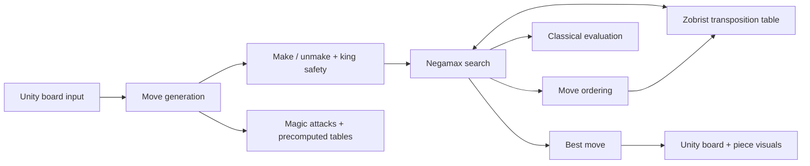

# StrangeChess
Custom Chess Engine (~1900 Elo) written in C# for Unity, which is built completely from scratch without using existing chess engine libraries.

Try it out yourself - https://jayesh27.itch.io/strangechess

## Description - Overview
I started this as a hobby project. My first implementation made many mistakes example, using mailbox board representation so had to rewrite the entire engine again while learning and implementing topics like bitboards, magic bitboards, minimax, alpha beta pruning, negamax, Zobrist hashing, bitwise operations, evaluation design, and many more.

Since the engine is built from scratch, it can be extended with custom pieces and rules. I used this flexibility in my hackathon project RPG Chess, where I added a custom piece called the Dragon.
https://github.com/Jayesh-27/RPG-CHESS.

## Performance

| Benchmark | Result |
| ---------- | ------ |
| Perft Depth 6 | 119,060,324 nodes |
| Time | 10.959 s |
| Nodes/Second | **10.86 million NPS** |
| CPU | AMD Ryzen 5 5600G |

## Highlights

- Custom **64-bit bitboard** chess engine.
- **Magic bitboards** and precomputed attack tables for fast rook, bishop, and queen move generation.
- Iterative-deepening **Negamax** search with **alpha-beta pruning**, quiescence search, a transposition table, null-move pruning, and late-move reductions.
- Tapered middlegame/endgame evaluation with material, piece-square tables, pawn structure, king safety, development, and endgame terms.
- Interactive Unity board with legal-move selection, castling, en passant, promotion visuals, and FEN loading.
- Perft validation, Zobrist hashing, optional Stockfish UCI play, and an automated engine-vs-Stockfish tournament mode.

## Engine architecture

## Core engine techniques

### Board representation and move generation

- **64-bit bitboards** (`ulong`) using LERF mapping: `A1 = bit 0`, `H8 = bit 63`.
- Dual board representation: per-piece bitboards plus a `pieceType[64]` mailbox array.
- Separate white, black, and all-piece occupancy bitboards.
- **Magic bitboards** for rook and bishop attacks, with precomputed blocker masks and attack tables.
- Carry-rippler subset enumeration used to build sliding-piece attack tables.
- Precomputed knight and king attack maps for all 64 squares.
- Pawn move generation through bit shifts and file masks to prevent edge wraparound.
- Pseudo-legal move generation followed by make/unmake legality checks to ensure the moving side's king is safe.
- Special-move support for castling, en passant, double pawn pushes, captures, and promotion move flags.

### Low-level optimizations

- Least-significant-one-bit extraction to iterate pieces and moves.
- `x &= x - 1` bit clearing to consume set bits efficiently.
- **De Bruijn bitscan** for bitboard-to-square conversion.
- SWAR/parallel **PopCount** implementation for material and phase counting.
- Bitwise occupancy updates using shifts, masks, OR, AND, XOR, and packed constants.
- 16-bit packed moves: 6 bits for source, 6 bits for destination, and 4 bits for the move flag.
- Preallocated move and score buffers for 64 plies, avoiding search-time allocations.

### Search and pruning

- **Negamax** search with **alpha-beta pruning**.
- **Iterative deepening** with time control.
- **Aspiration windows** around the previous iteration's score.
- **Quiescence search** over tactical captures and promotions at the horizon.
- **Null-move pruning** with a non-pawn-material safeguard.
- **Late Move Reductions (LMR)** for later quiet moves.
- Killer-move heuristic.
- Move ordering with transposition-table moves, **MVV-LVA** capture scoring, killer moves, and promotion bonuses.
- Mate/stalemate detection and repetition checks during search.

### Zobrist hashing and transposition table

- Incremental **Zobrist hashing** for piece-square placement, castling rights, en-passant state, and side to move.
- Fixed-size, direct-mapped transposition table with `2^20` entries.
- Exact, alpha/upper-bound, and beta/lower-bound table entries.
- Depth-aware replacement, stored best move, and mate-score ply adjustments.

### Evaluation

The evaluation blends middlegame and endgame scores according to the material phase. It includes:

- Centipawn material evaluation.
- Piece-square tables for all piece types, with dedicated middlegame/endgame pawn and king tables.
- Bishop-pair bonus.
- Rooks on open and semi-open files, plus seventh-rank bonuses.
- Pawn-structure terms for doubled, isolated, and passed pawns.
- Castled king pawn-shield evaluation.
- Development and early-queen-move penalties.
- Castling incentives and an endgame king mop-up term.

## Project features

| Area | Included |
| --- | --- |
| Gameplay | Click-to-select legal moves, visual piece movement, castling, en passant, promotion visuals |
| Position setup | FEN parsing: pieces, active colour, castling rights, en passant, halfmove clock, fullmove number |
| Testing | Perft node counter, root divide output, nodes-per-second timing |
| Stockfish | UCI process integration, move-history replay, centipawn/mate evaluation parsing, optional Elo limiting |
| Tournament mode | Automated self-engine vs Stockfish matches, colour alternation, PGN-style output, adaptive Stockfish Elo setting |

## Code map

| Script | Responsibility |
| --- | --- |
| `Assets/Engine/Board.cs` | Bitboards, board state, magic-table construction, FEN loading, and visual-piece helpers |
| `Assets/Engine/Chess.cs` | Move generation, make/unmake, legality checking, move packing, and incremental position state |
| `Assets/Engine/AI.cs` | Search, pruning, move ordering, transposition table, evaluation, and time control |
| `Assets/Engine/Zobrist.cs` | Deterministic Zobrist-key initialization |
| `Assets/Engine/Perft.cs` | Recursive move-generation verification and NPS reporting |
| `Assets/Engine/ClickDetector.cs` | Unity raycast input and human-move interaction |
| `Assets/Engine/StockfishTester.cs` | Optional UCI Stockfish opponent and evaluation display data |
| `Assets/Engine/EngineTournament.cs` | Automated custom-engine vs Stockfish tournament runner |

## References
- Chess Programming Wiki
- Sebastian Lague's Chess Programming series - A great place to start
- r/chessprogramming
